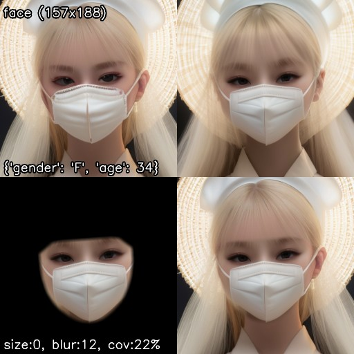

# InsightFace components
Component implementation using [InsightFace](https://github.com/deepinsight/insightface/).

To use the following components, please enable 'insightface' option under "Additional components" in the Face Editor section of the "Settings" tab.

## 1. Face Detector
A Face Detector implemented using [the InsightFace Detection module](https://github.com/deepinsight/insightface/).

#### Name
- InsightFace

#### Implementation
- [InsightFaceDetector](detector.py)

#### Recognized UI settings
- N/A

#### Configuration Parameters (in JSON)
- `conf` (float, optional, default: 0.5): The confidence threshold for face detection. This specifies the minimum confidence for a face to be detected. The higher this value, the fewer faces will be detected, and the lower this value, the more faces will be detected.

#### Returns
- tag: "face"
- attributes: 
  - "gender": The detected gender of the face ("M" for male, "F" for female).
  - "age": The detected age of the face.
- landmarks: 5 (both eyes, the nose, and both ends of the mouth)

**Note**  
Please be aware that the accuracy of gender and age detection with the InsightFace Detector is at a level where it can just about be used for experimental purposes.

#### Usage in Workflows
- [insightface.json](../../../workflows/examples/insightface.json)
- [blur_young_people.json](../../../workflows/examples/blur_young_people.json)

---

## 2. Mask Generator
This component utilizes the facial landmark detection feature of InsightFace to generate masks. It identifies the 106 facial landmarks provided by the InsightFace's 'landmark_2d_106' model and uses them to construct the mask.

#### Name
- InsightFace

#### Implementation
- [InsightFaceMaskGenerator](mask_generator.py)

#### Recognized UI settings
- Use minimal area (for close faces)
- Mask size

#### Configuration Parameters (in JSON)
- `use_convex_hull` (boolean, default: True): If set to True, the mask is created based on the convex hull (the smallest convex polygon that contains all the points) of the facial landmarks. This can help to create a more uniform and regular mask shape. If False, the mask is directly based on the face landmarks, possibly leading to a more irregular shape.
- `dilate_size` (integer, default: -1): Determines the size of the morphological dilation and erosion processes. These operations can adjust the mask size and smooth its edges. If set to -1, the dilation size will be automatically set to 0 if `use_convex_hull` is True, or 40 if `use_convex_hull` is False.

#### Usage in Workflows
- [insightface.json](../../../workflows/examples/insightface.json)
